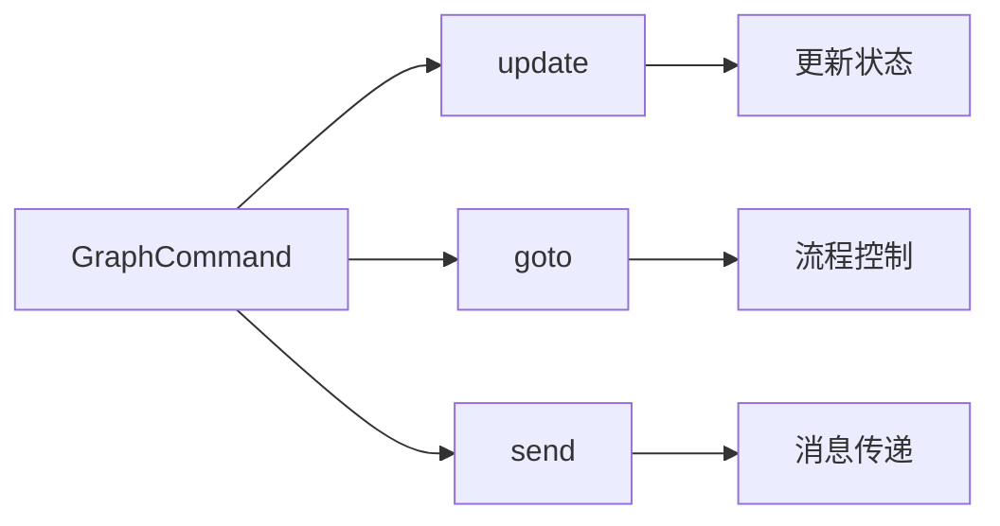
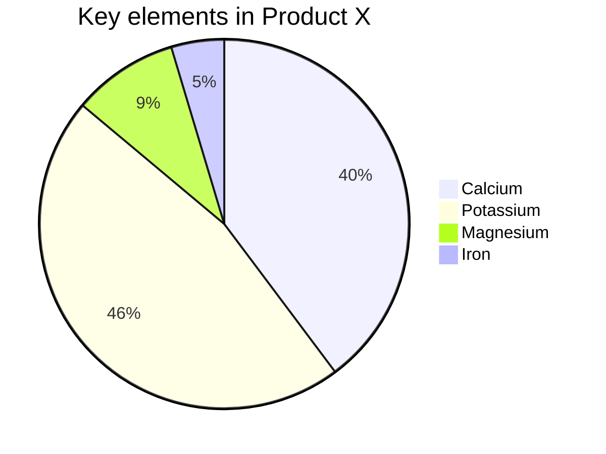
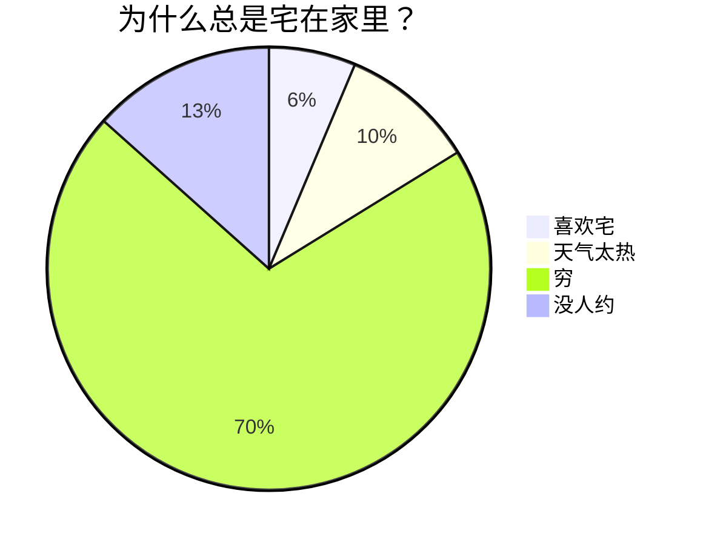
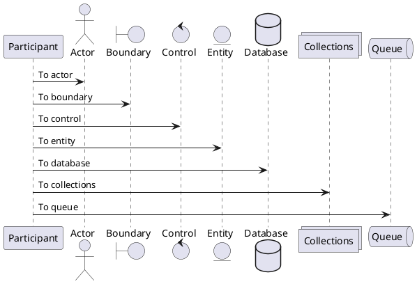

# 人工智能写作工具：公交车上的公众号创作利器

## 关于人工智能写作的一些思考

在快节奏的现代生活中，自媒体博主面临如何高效利用碎片时间的挑战。特别是在公交车、地铁等通勤场景中，时间往往被白白浪费。我最近在开发一款工具，旨在帮助自媒体博主在公交车上高效撰写和发布公众号文章，充分利用碎片时间，同时降低写作和排版的负担。

### 为什么要在公交车上写公众号文章？

1. **碎片时间的利用**\
   我经常乘坐香港的地铁和公交，发现通勤时间占据了每天的很大一部分。这些时间如果能被有效利用，就能产出更有意义的成果，比如一篇高质量的公众号文章。

2. **手机写作的灵活性**\
   相比于电脑，手机写作更便于随时记录灵感。灵光一现的想法可以迅速记录，整理后即可成为一篇优质博文。而坐在电脑前，反而可能因为环境限制而难以捕捉灵感。

3. **电脑写作的痛点**\
   使用电脑撰写公众号文章耗时耗力，尤其是在排版和登录后台的操作上。手机端的工具可以简化这些流程，让创作更高效。

### 核心观点：专注于有意义的事情

在创作过程中，我认为需要明确“有意义的事情”作为目标。评价一天是否充实的标准，应该是完成了这些有意义的事情，而不是被琐碎事务所牵绊。写作时，可以通过以下方式实现高效表达：

- **提纲法**：列出意义点（每行一个核心观点），逐一展开。
- **无序表达**：意义点无需严格顺序，但需确保全覆盖要表达的内容，类似状态机的逻辑。
- **排版优化**：通过工具自动优化流水账式的草稿，生成美观大气的文章。

### 工具的核心功能

我开发的这款工具旨在解决自媒体博主在碎片时间创作的痛点，以下是主要功能：

1. **自动排版**\
   将流水账式的内容（按行记录的意义点）自动转化为美观大气的公众号文章格式，省去手动排版的麻烦。

2. **草稿箱发布**\
   支持不登录公众号后台，直接将文章发布到微信公众号草稿箱。之所以不直接发布，是为了保留预览环节，避免发布后无法修改的尴尬。

3. **灵感记录与整理**\
   支持随时记录灵感，自动整理为提纲或文章框架，降低创作门槛。

4. **随机插图功能**\
   内置文生图工具，可根据文章内容在适当位置自动插入图片，未来计划支持多张图片自动插入。

5. **更新计划与热点推送**

   - 提供近期热点清单和衍生标题，提示博主应该撰写哪些内容。
   - 推送行业热点文章，助力博主紧跟趋势。

6. **文章抓取与改写**
   - 支持通过链接抓取其他公众号文章内容，自动导入编辑器。
   - 提供全文改写功能，基于原始内容生成新的表达方式。

### 快速写作的几种方法

为了适应不同场景，我总结了几种快速写作公众号文章的方法：

1. **提纲法**\
   先列出提纲，再逐一展开每个意义点。适合逻辑清晰的内容表达。

2. **思路堆积法**\
   无需严格提纲，想到什么写什么，再通过工具整理成结构化文章。

3. **无提纲写作**\
   直接记录灵感，依靠工具的自动排版功能生成最终文章。

4. **简单大气排版模板**\
   工具提供多种简洁美观的排版模板，确保文章视觉效果专业。


Markdown 是一种轻量级标记语言，用于格式化纯文本。它以简单、直观的语法而著称，可以快速地生成 HTML。Markdown 是写作与代码的完美结合，既简单又强大。

## Markdown 基础语法

### 1. 标题：让你的内容层次分明

用 `#` 号来创建标题。标题从 `#` 开始，`#` 的数量表示标题的级别。

```markdown
# 一级标题

## 二级标题

### 三级标题

#### 四级标题
```

以上代码将渲染出一组层次分明的标题，使你的内容井井有条。

### 2. 段落与换行：自然流畅

Markdown 中的段落就是一行接一行的文本。要创建新段落，只需在两行文本之间空一行。

### 3. 字体样式：强调你的文字

- **粗体**：用两个星号或下划线包裹文字，如 `**粗体**` 或 `__粗体__`。
- _斜体_：用一个星号或下划线包裹文字，如 `*斜体*` 或 `_斜体_`。
- ~~删除线~~：用两个波浪线包裹文字，如 `~~删除线~~`。
- ==高亮==：用两个等号包裹文字，如 `==高亮==`。
- ++下划线++：用两个加号包裹文字，如 `++下划线++`。
- ~波浪线~：用一个波浪线包裹文字，如 `~波浪线~`。

这些简单的标记可以让你的内容更有层次感和重点突出。

### 4. 列表：整洁有序

- **无序列表**：用 `-`、`*` 或 `+` 加空格开始一行。
- **有序列表**：使用数字加点号（`1.`、`2.`）开始一行。

在列表中嵌套其他内容？只需缩进即可实现嵌套效果。

- 无序列表项 1
  1. 嵌套有序列表项 1
  2. 嵌套有序列表项 2
- 无序列表项 2

1. 有序列表项 1
2. 有序列表项 2

### 5. 链接与图片：丰富内容

- **链接**：用方括号和圆括号创建链接 `[显示文本](链接地址)`。
- **图片**：和链接类似，只需在前面加上 `!`，如 ``。

> 因微信公众号平台不支持除公众号内容以外的链接，故其他平台的链接，会呈现链接样式但无法点击跳转。

> 对于这些链接请注意明文书写，或点击左上角「格式->微信外链接转底部引用」开启引用，这样就可以在底部观察到链接指向。

另外，使用 `<,>` 语法可以创建横屏滑动幻灯片，支持微信公众号平台。建议使用相似尺寸的图片以获得最佳显示效果。

### 6. 引用：引用名言或引人深思的句子

使用 `>` 来创建引用，只需在文本前面加上它。多层引用？在前一层 `>` 后再加一个就行。

> 这是一个引用
>
> > 这是一个嵌套引用

这让你的引用更加富有层次感。

### 7. 代码块：展示你的代码

- **行内代码**：用反引号包裹，如 `code`。
- **代码块**：用三个反引号包裹，并指定语言，如：

```js
console.log(`Hello, Doocs!`)
```

语法高亮让你的代码更易读。

### 8. 分割线：分割内容

用三个或更多的 `-`、`*` 或 `_` 来创建分割线。

---

为你的内容添加视觉分隔。

### 9. 表格：清晰展示数据

Markdown 支持简单的表格，用 `|` 和 `-` 分隔单元格和表头。

| 项目人员                                    | 邮箱                   | 微信号       |
| ------------------------------------------- | ---------------------- | ------------ |
| [yanglbme](https://github.com/yanglbme)     | contact@yanglibin.info | YLB0109      |
| [YangFong](https://github.com/YangFong)     | yangfong2022@gmail.com | yq2419731931 |
| [thinkasany](https://github.com/thinkasany) | thinkasany@gmail.com   | thinkasany   |

这样的表格让数据展示更为清爽！

> 手动编写标记太麻烦？我们提供了便捷方式。左上方点击「编辑->插入表格」，即可快速实现表格渲染。

## Markdown 进阶技巧

### 1. LaTeX 公式：完美展示数学表达式

Markdown 允许嵌入 LaTeX 语法展示数学公式：

- **行内公式**：用 `$` 包裹公式，如 $E = mc^2$。
- **块级公式**：用 `$$` 包裹公式，如：

$$
\begin{aligned}
d_{i, j} &\leftarrow d_{i, j} + 1 \\
d_{i, y + 1} &\leftarrow d_{i, y + 1} - 1 \\
d_{x + 1, j} &\leftarrow d_{x + 1, j} - 1 \\
d_{x + 1, y + 1} &\leftarrow d_{x + 1, y + 1} + 1
\end{aligned}
$$

1. 列表内块公式 1

$$
\chi^2 = \sum \frac{(O - E)^2}{E}
$$

2. 列表内块公式 2

$$
\chi^2 = \sum \frac{(|O - E| - 0.5)^2}{E}
$$

这是展示复杂数学表达的利器！

### 2. Mermaid 流程图：可视化流程

Mermaid 是强大的可视化工具，可以在 Markdown 中创建流程图、时序图等。








这种方式不仅能直观展示流程，还能提升文档的专业性。

> 更多用法，参见：[Mermaid User Guide](https://mermaid.js.org/intro/getting-started.html)。

### 3. PlantUML 流程图：可视化流程

PlantUML 是强大的可视化工具，可以在 Markdown 中创建流程图、时序图等。



> 更多用法，参见：[PlantUML 主页](https://plantuml.com/zh/)。

### 4. Ruby 注音：注音标注

支持两种格式：

```md
1. [文字]{注音}
2. [文字]^(注音)
```

渲染效果如下：

[你好]{nǐ hǎo} [世界]{shì jiè}

支持四种分隔符： `・`（中点）、`．` (全角句点)、`。` (中文句号)、`-` (英文减号)

示例：

```md
[你好世界]{nǐ・hǎo・shì・jiè}
[小夜時雨]^(さ・よ・しぐれ)
```

[你好世界]{nǐ・hǎo・shì・jiè}
[小夜時雨]^(さ・よ・しぐれ)

当字符串数量与分隔符数量不匹配时，会自动匹配到最合适的分隔符。

```md
[小夜時雨]{さ・よ・しぐれ}
[小夜時雨]{さ・よ}
[小夜]{さ・よ・しぐれ}
[小夜時雨]{さ・よ・しぐれ・extra}
```

[小夜時雨]{さ・よ・しぐれ}
[小夜時雨]{さ・よ}
[小夜]{さ・よ・しぐれ}
[小夜時雨]{さ・よ・しぐれ・extra}

## 结语

Markdown 是一种简单、强大且易于掌握的标记语言，通过学习基础和进阶语法，你可以快速创作内容并有效传达信息。无论是技术文档、个人博客还是项目说明，Markdown 都是你的得力助手。希望这篇内容能够带你全面了解 Markdown 的潜力，让你的写作更加丰富多彩！

现在，拿起 Markdown 编辑器，开始创作吧！探索 Markdown 的世界，你会发现它远比想象中更精彩！
